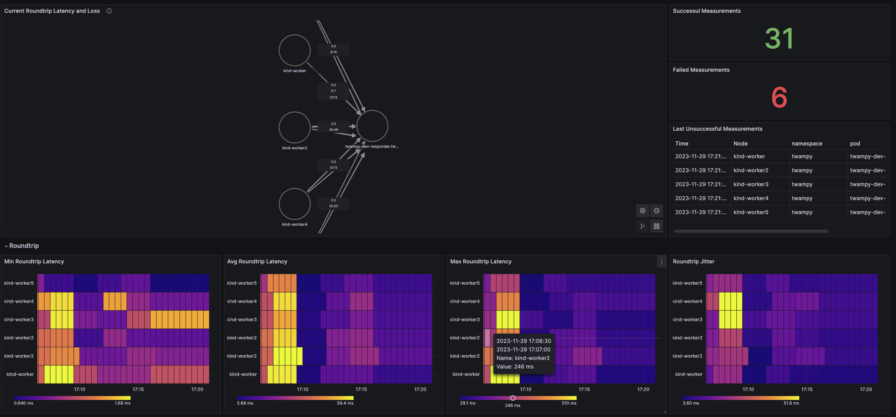

# Python tools for TWAMP and TWAMP light



This is the Python2 to Python3 conversion of [twampy](https://github.com/nokia/twampy/tree/master).

On top of that it supercharges it by adding:
- Helm chart for Kubernetes
- Prometheus metrics
- Grafana dashboard

## Usage

Start responder:

```bash
python3 twampy.py responder
```

Start sender:

```bash
python3 twampy.py sender
```

## Prometheus metrics

The sender component is the only component that exposes metrics at this moment. 
Metrics can be enabled by running the sender via:

```bash
python3 twampy.py sender --metrics
```

Metrics for plotting the Node Graph in Grafana can be enabled by running the sender via:

```bash
python3 twampy.py sender --nodegraph
```

⚠️ This is only experimental. It seems that Grafana has several
problems with plotting the Node Graph based on Prometheus metrics.
The metric suitable for plotting the Node Graph in Grafana is `twampy_edge`. 
Enabling this metric in environments with a large number of nodes can cause 
problems with cardinality in Prometheus. 
See [Grafana docs](https://grafana.com/docs/grafana/latest/panels-visualizations/visualizations/node-graph/)
for more information on the Node Graph.

The metrics are exposed on port 8000.


```bash

curl localhost:8000/metrics

# HELP python_gc_objects_collected_total Objects collected during gc
# TYPE python_gc_objects_collected_total counter
python_gc_objects_collected_total{generation="0"} 319.0
python_gc_objects_collected_total{generation="1"} 60.0
python_gc_objects_collected_total{generation="2"} 0.0
# HELP python_gc_objects_uncollectable_total Uncollectable objects found during GC
# TYPE python_gc_objects_uncollectable_total counter
python_gc_objects_uncollectable_total{generation="0"} 0.0
python_gc_objects_uncollectable_total{generation="1"} 0.0
python_gc_objects_uncollectable_total{generation="2"} 0.0
# HELP python_gc_collections_total Number of times this generation was collected
# TYPE python_gc_collections_total counter
python_gc_collections_total{generation="0"} 32.0
python_gc_collections_total{generation="1"} 2.0
python_gc_collections_total{generation="2"} 0.0
# HELP python_info Python platform information
# TYPE python_info gauge
python_info{implementation="CPython",major="3",minor="12",patchlevel="0",version="3.12.0"} 1.0
# HELP process_virtual_memory_bytes Virtual memory size in bytes.
# TYPE process_virtual_memory_bytes gauge
process_virtual_memory_bytes 2.67464704e+08
# HELP process_resident_memory_bytes Resident memory size in bytes.
# TYPE process_resident_memory_bytes gauge
process_resident_memory_bytes 9.035776e+06
# HELP process_start_time_seconds Start time of the process since unix epoch in seconds.
# TYPE process_start_time_seconds gauge
process_start_time_seconds 1.70125332948e+09
# HELP process_cpu_seconds_total Total user and system CPU time spent in seconds.
# TYPE process_cpu_seconds_total counter
process_cpu_seconds_total 10.219999999999999
# HELP process_open_fds Number of open file descriptors.
# TYPE process_open_fds gauge
process_open_fds 8.0
# HELP process_max_fds Maximum number of open file descriptors.
# TYPE process_max_fds gauge
process_max_fds 1.048576e+06
# HELP twampy_edge Metric suitable for plotting node graph in Grafana. mainstat is loss and secondarystat is avg RTT latency in ms
# TYPE twampy_edge gauge
twampy_edge{id="fe7abd77ae43-twampy-responder",mainstat="0.0",secondarystat="0.95",source="fe7abd77ae43",target="twampy-responder"} 1.0
# HELP twampy_latency_min TWAMP min latency in ms
# TYPE twampy_latency_min gauge
twampy_latency_min{direction="outbound"} 0.26
twampy_latency_min{direction="inbound"} 0.04
twampy_latency_min{direction="roundtrip"} 0.31
# HELP twampy_latency_avg TWAMP avg latency in ms
# TYPE twampy_latency_avg gauge
twampy_latency_avg{direction="outbound"} 0.82
twampy_latency_avg{direction="inbound"} 0.12
twampy_latency_avg{direction="roundtrip"} 0.95
# HELP twampy_latency_max TWAMP max latency in ms
# TYPE twampy_latency_max gauge
twampy_latency_max{direction="outbound"} 15.62
twampy_latency_max{direction="inbound"} 3.7
twampy_latency_max{direction="roundtrip"} 16.06
# HELP twampy_jitter TWAMP jitter in ms
# TYPE twampy_jitter gauge
twampy_jitter{direction="outbound"} 0.84
twampy_jitter{direction="inbound"} 0.06
twampy_jitter{direction="roundtrip"} 0.9
# HELP twampy_loss TWAMP loss in percent
# TYPE twampy_loss gauge
twampy_loss{direction="outbound"} 0.0
twampy_loss{direction="inbound"} 0.0
twampy_loss{direction="roundtrip"} 0.0
# HELP twampy_result TWAMP result
# TYPE twampy_result gauge
twampy_result{twampy_result="ok"} 1.0
twampy_result{twampy_result="error"} 0.0
```


## Contributing

Contributions are welcome. Please open an issue or submit a pull request.


